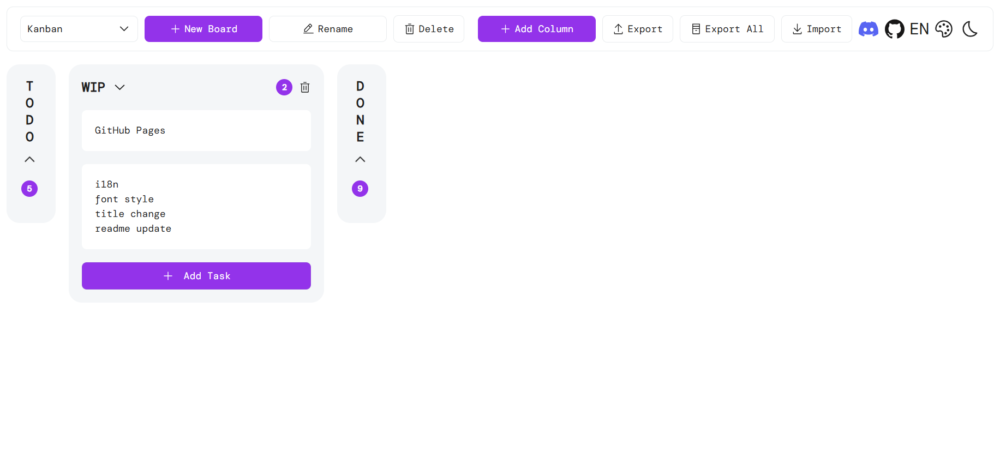

# kanban

> **🚀 Try it now: [https://noki-maker.github.io/kanban/](https://noki-maker.github.io/kanban/)**

A simple, self-hosted Kanban board that runs **entirely in your browser** — no server, no account, no data leaves your machine.

**简体中文版本见 [README.zh-CN.md](./README.zh-CN.md)。**



## Features

- **Boards, columns & tasks** — full drag-and-drop support for reordering and moving.
- **Markdown editing** — write in Markdown, preview live side-by-side; rendered task checkboxes follow the theme accent color.
- **Theming** — light / dark mode and an accent color picker, persisted across visits.
- **i18n** — built-in Simplified Chinese / English switching (one-click toggle, persisted).
- **Instant search** — press `Ctrl/Cmd + K` to search boards, columns and tasks across all boards, and jump straight to the result.
- **Backup & migration** — export boards to `.xlsx` and import them back, on any machine.
- **Privacy** — everything is stored locally in your browser; nothing leaves your device.

## Getting Started

You can use the app in two ways:

1. **Open the built site** — serve the static `dist/` output (or a hosted deployment) and open it in any modern browser.
2. **Run it locally with Vite** (requires Node.js ≥ 22 and pnpm):

```sh
pnpm install
pnpm dev
```

Your board is created automatically on first launch — there is nothing to configure.

## Usage Guide

### Global Search

Press `Ctrl/Cmd + K` anywhere (or click the **Search** button in the board toolbar) to open the spotlight-style search panel. It searches **across all boards** — board names, column titles and task content:

| Key                   | Action                   |
| --------------------- | ------------------------ |
| `↑` / `↓`             | Move through results     |
| `Enter`               | Open the selected result |
| `Esc` / click outside | Close the panel          |

- Matching text is highlighted in each result.
- Selecting a **task** switches to its board and opens the task drawer; selecting a **board** or **column** jumps straight to it.

### Boards

A **board** is a collection of columns. The board toolbar (top bar) gives you:

| Action       | How                                                                  |
| ------------ | -------------------------------------------------------------------- |
| Switch board | Pick one from the dropdown on the left                               |
| New Board    | Click **New Board**, enter a name, and press Enter                   |
| Rename       | Click **Rename** and type a new name                                 |
| Delete       | Click **Delete** and confirm — removes the board and all its columns |

Your last-used board is remembered and reopened next time.

### Columns

- **Add a column** — click **Add Column**, type a name, press Enter (or click away).
- **Rename a column** — double-click the column title and edit it.
- **Reorder columns** — drag a column by its header and drop it elsewhere.
- **Collapse / expand** — click the chevron (⌄) in the column header to toggle between the normal horizontal mode and a slim vertical strip.
- **Delete a column** — click the trash icon in the column header (horizontal mode only) and confirm.

### Tasks

- **Add a task** — click **Add Task** at the bottom of a column, type the content, press Enter (or click away).
- **Edit a task** — click a task card to open the **task drawer**, where you can rewrite it as Markdown. The name of the task's column is shown next to the **Save** button so you always know where you are.
- **Move tasks** — drag a task card and drop it anywhere: reorder within a column or move it to another column.
- **Delete a task** — open the task drawer and click the trash icon in the top-right corner.

### Task Drawer (split view)

Clicking a task opens a right-side drawer with a **side-by-side split**:

- **Left — Edit**: write the task content in Markdown.
- **Right — Preview**: the rendered result updates live as you type.
- **Drag the divider** between the two panes to resize them (20%–80%).

Drawer shortcuts:

| Key                | Action                |
| ------------------ | --------------------- |
| `Esc`              | Close the drawer      |
| `Ctrl/Cmd + Enter` | Save and close        |
| `Ctrl/Cmd + S`     | Save and keep editing |

Click **Save** to persist your changes, or click away / press `Esc` to discard them.

### Markdown

Task content supports Markdown, so cards can contain formatted text:

- Headings, bold/italic/strikethrough, inline code
- Fenced code blocks with syntax highlighting (e.g. ` ```js `)
- Links, images, quotes, tables, horizontal rules
- Task lists: `- [ ] todo`, `- [x] done`
- Single line breaks render as line breaks

Raw HTML is disabled and all output is sanitized.

### Backup & Migration

Since data lives in the browser (IndexedDB), use the export/import tools to back up or move your board. They live under the **⇄ (import/export)** button in the board toolbar:

| Menu item      | What it does                                                                                                                |
| -------------- | --------------------------------------------------------------------------------------------------------------------------- |
| **Export**     | Downloads the current board as an `.xlsx` file (one sheet per column)                                                       |
| **Export All** | Downloads every board into a single `.xlsx` workbook                                                                        |
| **Import**     | Loads `.xlsx` / `.xls` files. Sheets matching an existing board name are **merged into it**; other sheets create new boards |

> Tip: export regularly — clearing your browser's site data will erase your board.

### Language & Theme

- **Language** — the button in the top-right corner toggles between **中文** and **EN**. Your choice is remembered (and so is the page title, which switches between "Kanban" and "看板").
- **Theme** — the same toolbar hosts a light / dark mode toggle and a color picker for the accent color. Both are persisted as well.

## Data & Privacy

- All columns and tasks are stored in your browser's **IndexedDB**; nothing is ever sent to a server.
- Data is tied to the browser/profile and device you use — it does not follow you across browsers or machines.

## Development

See [CONTRIBUTING.md](./CONTRIBUTING.md) for the project structure, tech stack, available scripts, and contribution guidelines.
